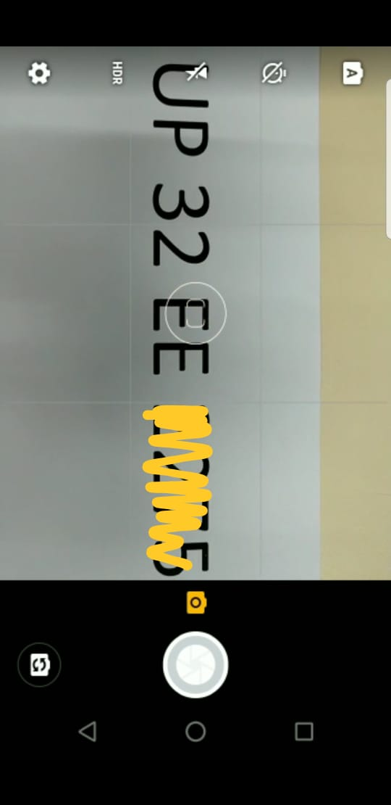
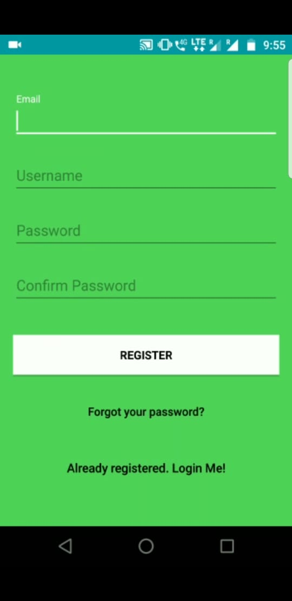
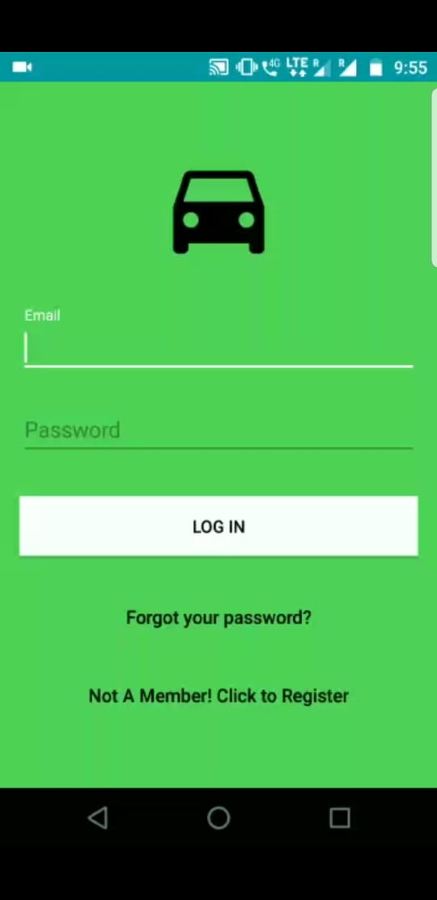

NUMBER PLATE RECOGNITION APP

An App that captures the image of number plate of a vehicle and uses Tesseract Api identifies the text and using a government provided api
identifies the owner and vehicle details.

The app for now has following features:

Registration page: To register a new user of the app. The data is stored in Firebase database and Firebase authentication is used
for authentication. Other than this user also has "forgot password" option, which asks for user's provided email and sends a reset
link to the specified email.

Login Page: User can login to the app by providing their email and password. Firebase authentication is used.

UsersList Page: A particular email and password are provided to the admin that gives the admin access to Userlist page where admin 
can see the list of all the registered users, their emails, names and passwords.

Main page: Has the database of the previously captured vehicles and also to capture new vehicle. 
after processing image the obtained number can be edited if there was any mistake in recognition else the number could be send to the government information portal(INDIA) for information retrieval.

For Tesseract Api Use related info Refer to this link: https://stackoverflow.com/questions/7710123/how-can-i-use-tesseract-in-android

